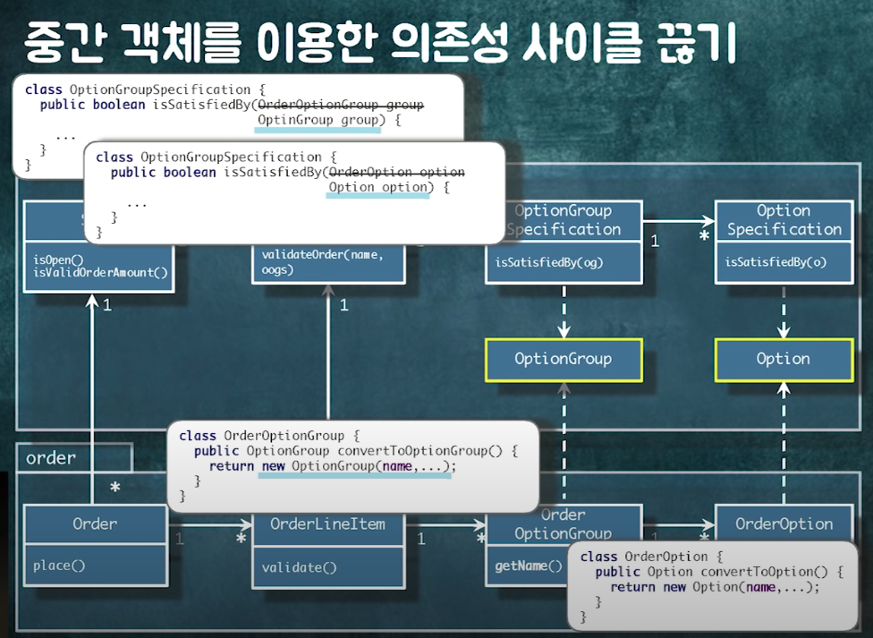
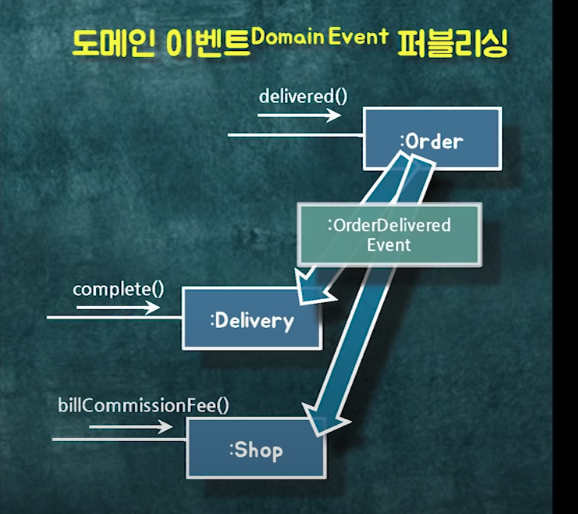
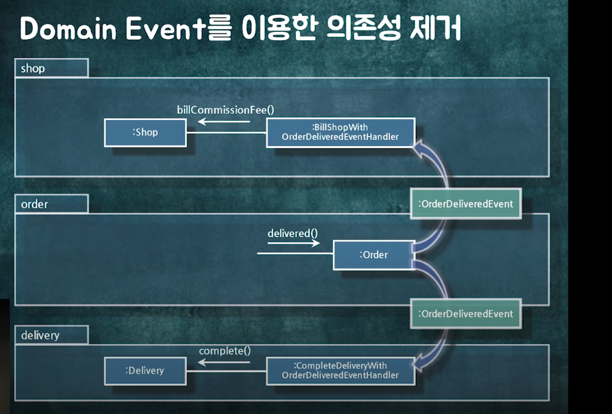
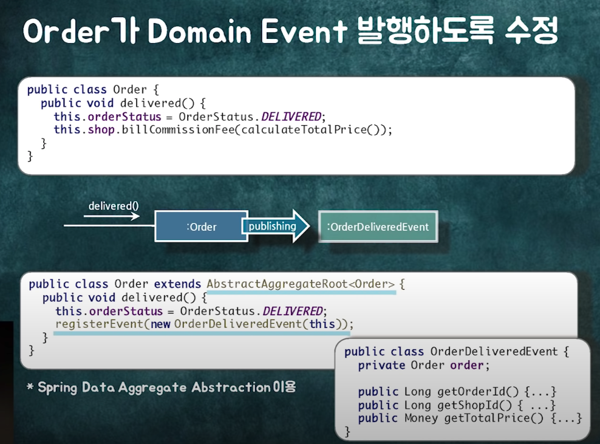
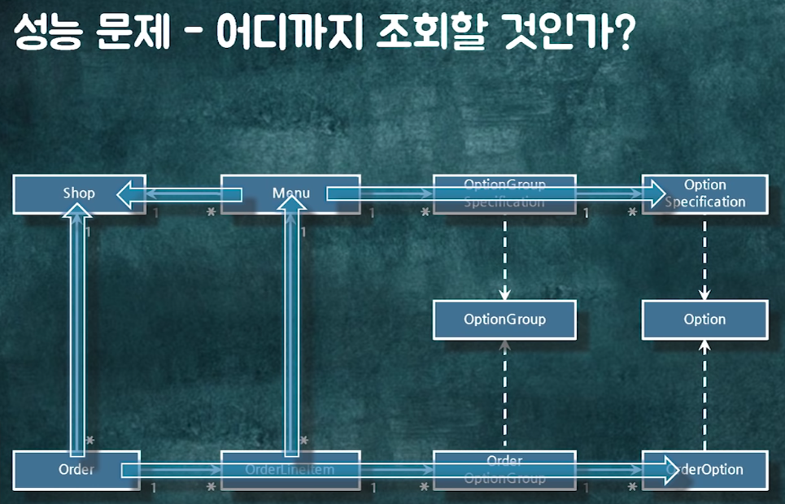
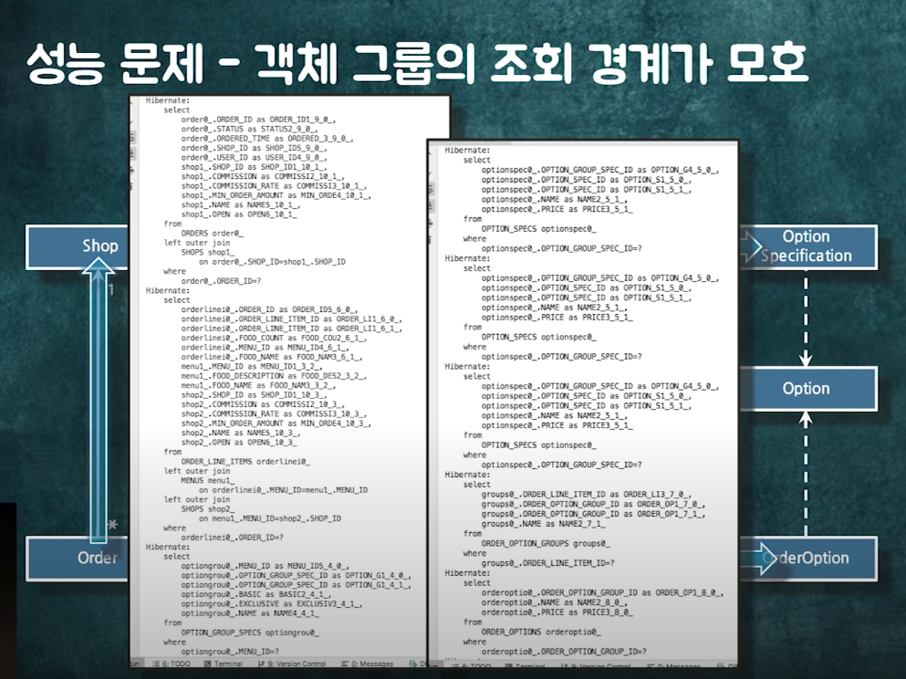
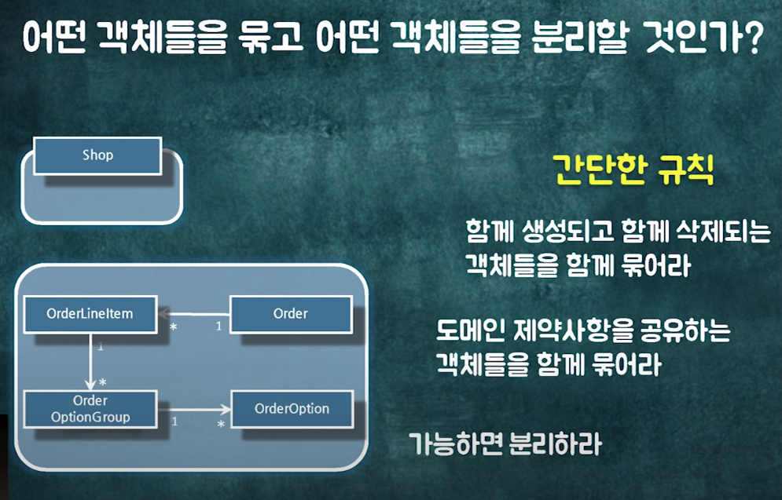

### 우아한 객체지향 세미나 자료

- 우아한 객체지향 자료 코딩해보기.
- 순환이 없는 의존성 구조 설계 
- JPA 의존관계를 두는 것과 ID 를 통해 조회하는 것의 기준.

</br>

### 우형 주문 도메인 AS-IS 코드의 문제점. 


</br>

- Shop <-> Order 패키지간의 순환 관계가 있음.


</br>

#### 순환 관계가 구린 이유

-  나중에 코드 수정 시, 가령 오더를 Validation 하는 코드를 제작하거나 수정하는 경우, 
변경의 범위를 어디까지 가져가야 할 지 모호한 경우가 생긴다 .

- 아래의 예시는 의도적으로 중간 객체를 만들어서 의도적으로 순환을 깬 경우이다.

- 세미나에서는 이것도 일종의 추상화라고 한다.  매뉴의 OptionGroup, Order 의 OptionGroup 에 대한 일종의 추상화라고 하고 같은 전략을 Cart <-> Menu , Cart <-> Order 등에서도 가져갈 수 있다고 한다.


단, 이런식의 중간 객체를 두는 추상화는 개발자가 초기 랜딩시에 이해하기 힘들고 손이 많이 간다.

세미나에서는 만약 저런 추상화를 자주 둬야 한다면 적용하되, 그게 아니라면 이전 버전( 순환이 있는) 것으로 두는것도 고려해 봄직 하다고 한다.

</br>



(그림오타 : 저 오른 아래의 OrderOption 은 사실 Option class 인데 오타이다.)


</br>


### 순환 관계를 제거하는 방법들 


#### 중간 객체 만들기


- 위의 " 순환 관계가 구린 이유"  탭에서 설명 

</br>

#### 도메인 이벤트로 받기

</br>




</br>

Order 가 바뀌면 Delivery, PayMent 도 바뀌어야함, 로지컬하게 봤을때 결합도가 있다고 할 수 있음.

하지만 객체간의 연관은 줄이면서, 로직컬한 순서를 유지하고 싶다면 도메인 이벤트를 채용해 봄직함.


</br>




</br>

이렇게 도메인 이벤트를 활용하면 Delivery -> Order, Shop -> Order 로의 연관을 제거함으로 순환을 없앨 수 있다

</br>




호출부에서 Order 이 직접 shop 을 가져와서 호출하는것 말고 이벤트만 발행하는 것을 볼 수 있다.


</br>


#### id 로 가져오기 

- 아래 "JPA 연관관계의 설계 - 어디까지 필드 (참조)로 가지고 있을까 ?" 에서 설명 

</br>

### JPA 연관관계의 설계 - 어디까지 필드 (참조)로 가지고 있을까 ?


#### 객체의 연관이 길면 안좋은 이유 

1. Lazy Loading 문제 
   - 어디까지 트랜잭션을 묶을건지 애매해짐, 너무 길면 많은 테이블에 대한 트랜잭션을 가지게 됨. 
   - 그렇다고 객체를 불러올때마다 lazy loading 을 한다면 성능 문제와 로깅이 더러움


1. 아래와 같은 의존관계에서


   
   

</br>

2. 레이지 로딩으로만 가져온다면 ?

   

-> 너무 많은 select == { 나쁜 가독성 } && {성능적인 하자} 


</br>

#### 연관관계로 묶는 기준

같은 도메인 제약사항을 공유 하는 것들을 묶어라.

가령, Order, Shop 이 있을때, Order 와 연관된 OrderItem 등의 객체는 연관관계로 가져가는 것이 합리적이다. Order 를 조회, 생성 할 때, Order 에 포함된 아이탬도 같이 따라오는 것이 합리적이라면 
eager loading ,cascade.all 도 같이 적용할 수 있다.


하지만 Shop 의 경우, Order 의 구성요소엔 필요하지만, 생성과 로딩되는 시점은 아예 다르다.

shopId 만 가지고 있고 연관관계로는 설정하지 않는 것이 좋아 보인다.

</br>


1. 세미나 : 연관관계 설정 규칙.

   


</br>


2. 실제 Order 의 엔티티

```java
@Entity
@Table(name = "ORDERS")
@Getter
public class Order extends AbstractAggregateRoot<Order> {
	public enum OrderStatus {ORDERED, PAYED, DELIVERED};

	@Id
	@GeneratedValue(strategy = GenerationType.IDENTITY)
	@Column(name = "ORDER_ID")
	private Long id;

	@Column(name = "USER_ID")
	private Long userId;

	@Column(name = "SHOP_ID")
	private Long shopId;

	@OneToMany(cascade = CascadeType.ALL)
	@JoinColumn(name = "ORDER_ID")
	private List<OrderLineItem> orderLineItems = new ArrayList<>();

	@Column(name = "ORDERED_TIME")
	private LocalDateTime orderedTime;

	@Column(name = "STATUS")
	@Enumerated(EnumType.STRING)
	private OrderStatus orderStatus;
	

```

</br>


세미나에서 말하는 추가적인 예시는  {장바구니} , {장바구니 항목} 사이에 연관관계를 두지 않는다는 것이다.

두 데이터는 직관적으로는 비슷하지만  lifeCycle 을 공유하지도 않고 목적도 다르다.

{장바구니 항목} 에서 {장바구니} id 를 가지고 있는것으로 충분하다고 본다.

